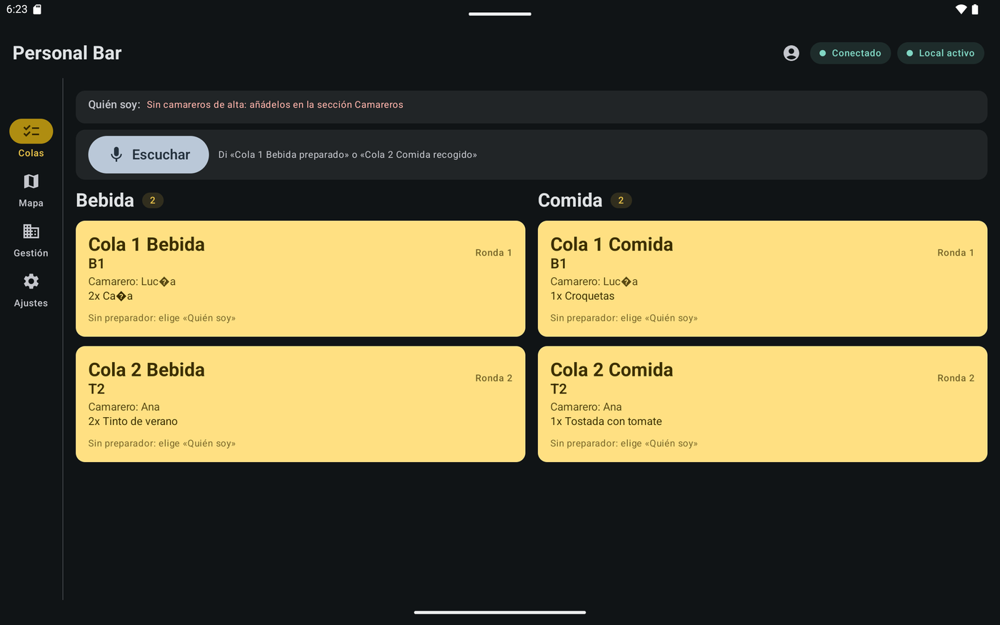
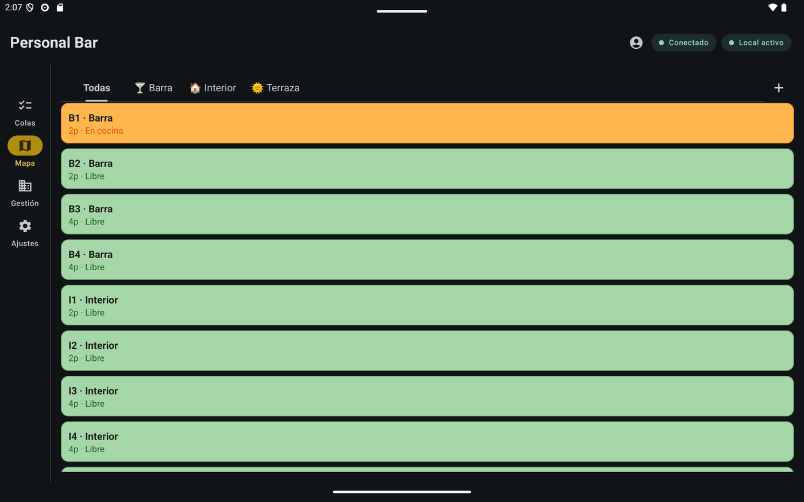
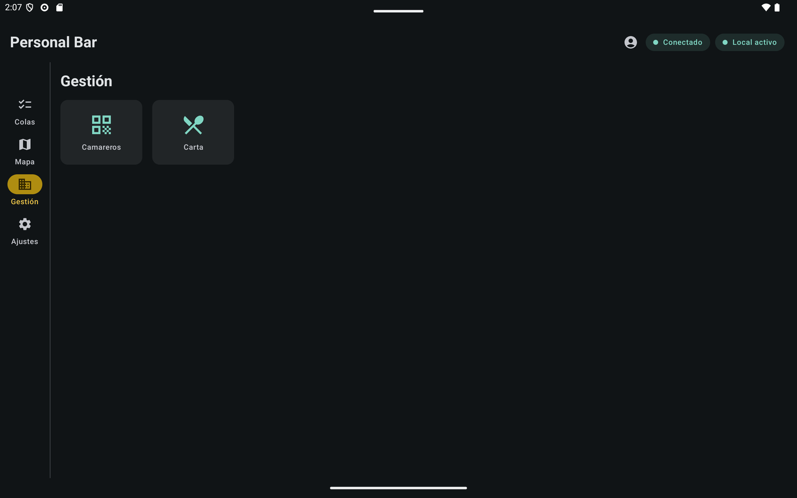
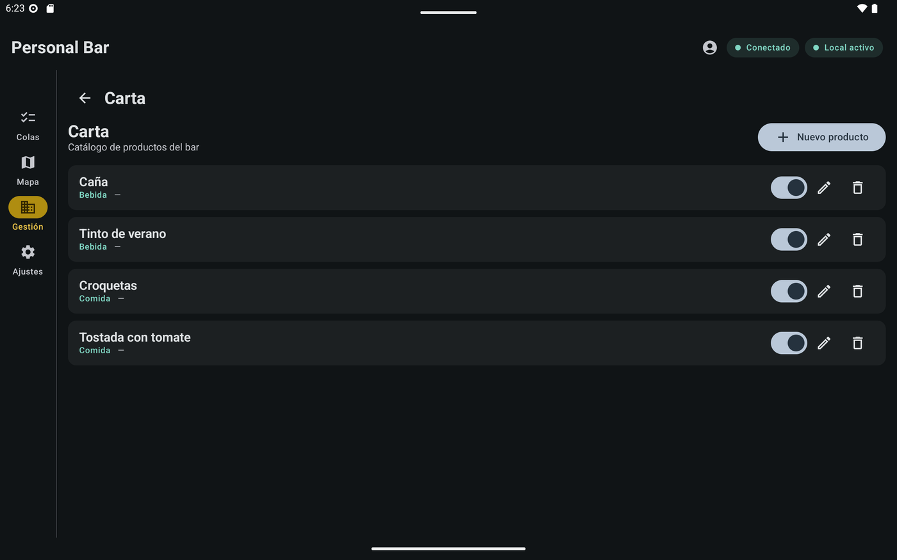
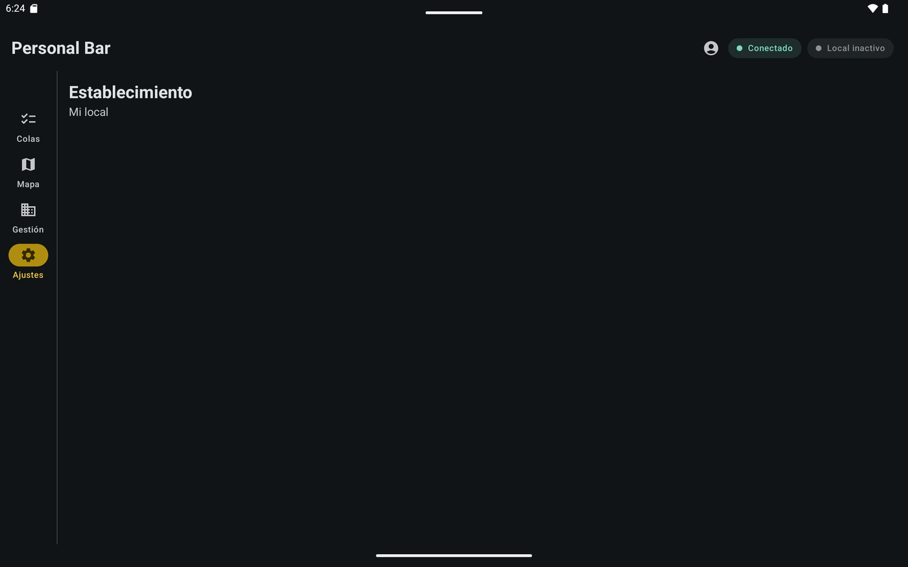

---
hide:
  - navigation
  - toc
title: Personal Bar
---

{ width="128" }

# 🍸 Personal Bar

**El puesto de barra que gestiona la sala.**

Colas de Bebida y Comida separadas y nodo LAN de la familia PersonalHostel: los Personal Commander de sala y terraza se conectan aquí, mandan rondas y la barra las prepara y entrega **por destino**.

[📖 Manual en la Wiki](https://github.com/jaminsmoke/PersonalBar/wiki){ .md-button .md-button--primary }

[Personal Comander](https://github.com/jaminsmoke/PersonalComander) · [PersonalHostel-Server](https://github.com/jaminsmoke/PersonalHostel-Server)

!!! info "v0.1 en desarrollo"
    Proyecto **v0.1** (Android 7.0+, tablet apaisado). El ciclo de la ronda — recibir, preparar, recoger — ya funciona; la versión pública llegará pronto.

## Para la barra

- :tropical_drink: **Expo de colas por destino**

    Bebida y Comida en dos columnas fijas. Cada ticket: mesa, ronda, camarero y líneas. «Preparado» registra quién lo preparó; «Recogido» saca el ticket de la cola.

- :material-server-network: **Nodo de sala LAN**

    Servidor Ktor integrado (puerto 8787). Los Commander se conectan, envían rondas y reciben el estado en tiempo real (SSE). La barra es la fuente de verdad de mesas, rondas y tickets.

- :material-qrcode: **Lista blanca del local**

    Alta de camareros por su QR de identidad (PersonalHostel-Server). Sin alta no hay acceso, aunque estén en el Wi‑Fi.

- :material-map: **Mapa de la sala**

    Salas y mesas canónicas del establecimiento (barra, interior, terraza…), replicadas a los Commander.

## Para el local

- :material-account-cog: **Gestión**

    Camareros (lista blanca) y carta del bar desde el hub de gestión, en la propia tablet.

- :material-ticket-confirmation: **Listo por destino**

    Las cañas no esperan a la pizza: cada destino avanza por su cuenta dentro de la ronda.

- :material-weather-night: **Marca dark premium**

    Design system navy & gold de la familia PersonalHostel.

- :material-cocktail: **Voz en la barra**

    «Lucía, Cola 1 Bebida preparado» — cambia estados de cola hablando, con el nombre del preparador.

## Así se ve en acción

<figure>

<figcaption>Colas de Bebida y Comida con los tickets por destino.</figcaption>
</figure>

<figure>

<figcaption>La sala del establecimiento, fuente de verdad del layout.</figcaption>
</figure>

<figure>

<figcaption>Hub de gestión: camareros y carta.</figcaption>
</figure>

<figure>

<figcaption>El catálogo de productos del bar.</figcaption>
</figure>

<figure>

<figcaption>El establecimiento: cuenta y local.</figcaption>
</figure>

## Requisitos

- **Android 7.0+** (API 24)
- **Tablet apaisado** (puesto estático de barra)
- Para el nodo: red local con los Personal Commander de sala/terraza

## Comunidad y ayuda

- [💬 Wiki — Nodo LAN](https://github.com/jaminsmoke/PersonalBar/wiki/Nodo-LAN)
- [🐛 Reportar un bug](https://github.com/jaminsmoke/PersonalBar/issues/new)
- [🤝 Contribuir](https://github.com/jaminsmoke/PersonalBar/blob/main/CONTRIBUTING.md)
- [🔒 Reportar una vulnerabilidad](https://github.com/jaminsmoke/PersonalBar/security/policy)
